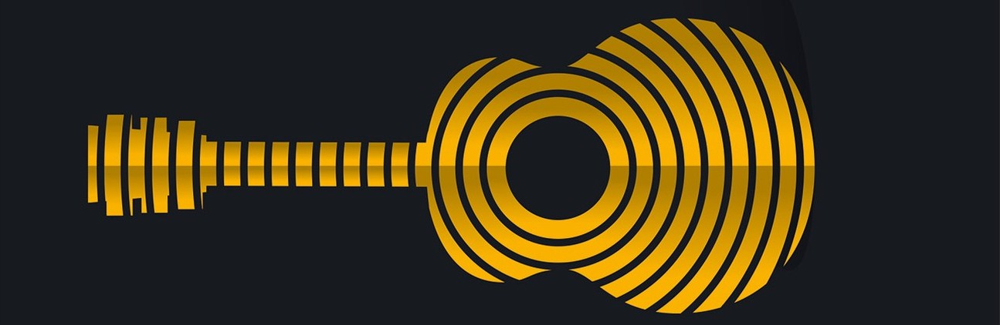

# Figures de Chladni
Projet dans le cadre du cours de 1ère année d'Equations Différentielles Partielles (EDP) à CentraleSupélec.

---

Ce notebook a pour but de montrer la résolution pratique d'Equations Différentielles Partielles avec le module *feniCS*. Le phénomène physique donnant les le système d'équation est la résonance au sein d'un corps de guitare, donnant naissance à des figures plus connues sous le nom de *Figures de Chladni*.

Il contient en outre :

- une preuve des équations d'onde qui régissent la formation des Figures de Chladni
- de nombreuses visualisations du phénomène physique
- la prise en compte de défauts aléatoires dans le corps de guitare
- un widget interractif permettant de simuler plus finement les figures.

Quelques résultats obtenus :

**Contact :**

- tony.wu@student-cs.fr
- https://www.linkedin.com/in/tonywu71/

